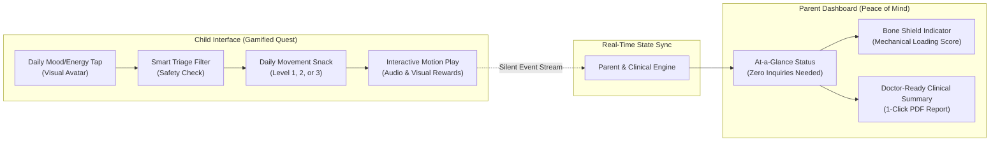

# 🛡️ GUTSY HERO (or CrohnQuest)
### Gamified Pediatric Exercise & Non-Verbal Family Communication in Pediatric Crohn's Disease

> **HackYeah 2026 — Category: SPORT & HEALTHCARE**  
> **Team:** JoseoKings  
> **Target Audience:** Children with Crohn's Disease / IBD (ages 6–12) undergoing corticosteroid therapies, their parents/caregivers, and pediatric gastroenterologists.

---

## 1. Executive Summary & Clinical Background

### The Hidden Medical Crisis
Children diagnosed with Crohn's disease frequently require cycles of corticosteroid therapy (e.g., prednisone, budesonide) to induce rapid remission during acute inflammatory flares. While life-saving, corticosteroids inflict two severe side effects on developing bodies:
1. **Glucocorticoid-Induced Osteopenia / Osteoporosis:** Steroids inhibit osteoblast proliferation and calcium absorption, leading to severe bone demineralization and elevated fracture risks during critical growth windows.
2. **Steroid Myopathy:** Accelerated muscle catabolism leading to proximal muscle atrophy, weakness, and chronic fatigue.

### The Problem: Communication Breakdown & Sedentarism
* **The "Interrogation Fatigue":** Anxious parents incessantly question their child (*"Does your tummy hurt?", "Did you go to the bathroom?", "Are you too tired?"*). Children feel scrutinized, labeled as "sick", and withdraw or hide symptoms.
* **The Sedentarism Trap:** Fear of pain or fatigue leads families to restrict physical activity, exacerbating bone loss and muscle wasting.
* **Clinical Gap:** Pediatricians urge physical activity, but there is zero digital tool tailored to prescribe safe, adaptive movement for pediatric IBD.

---

## 2. The Solution: A Bi-Directional Digital Bridge

**Gutsy Hero** transforms daily therapeutic movement into the primary **non-verbal communication channel** between the child and their caregivers.

---

## 3. Core Mechanics & Architecture

### A. The 3-Tier Exercise Prescription Engine (Safety First)
To avoid injuries, flare irritation, or enteropathic arthritis complications, all physical challenges are dynamically scaled:

| Level | Mode Name | Clinical Objective | Child Game Experience | Biomechanics |
| :--- | :--- | :--- | :--- | :--- |
| **Level 1** | **Calm & Stealth** | Vagal nerve stimulation, abdominal relaxation, prevent stiffness during flares/fatigue. | *"Dragon Belly Breathing"* & gentle floor stretches. | Zero impact, restorative mobility. |
| **Level 2** | **Force & Balance** | Combat steroid muscle catabolism without joint stress. | *"Ninja Flamingo"* (single-leg static balance) & Wall-Sit Power Charge. | Isometric strength, postural stability. |
| **Level 3** | **Steel Bone Mission** | **Mechanotransduction:** Induce osteogenesis to reverse steroid osteopenia. | *"10 Moon Hops"* (single-leg hops) & Frog Jumps. | High-peak impact, micro-dose plyometrics. |

### B. Cooperative Challenges (Inverting the Power Dynamic)
Instead of parents acting as authoritarian monitors (*"Go exercise now!"*), the child unlocks **Buddy Battles**:
> *"Mystery Challenge unlocked: Challenge your Dad to a 15-second Flamingo Balance. If both survive, unlock the Cosmic Cape!"*

### C. The Silent Communication Feed (Zero-Nag Protocol)
* **High-Impact Victory:** When the child finishes Level 3, the parent's device displays:  
  🟢 *"Leo crushed his Moon Hop mission today! Energy level is optimal."* $\rightarrow$ **Parent feels relaxed and refrains from questioning.**
* **Rest Day Acknowledgment:** When the child selects recovery mode:  
  🟡 *"Leo chose Rest & Recovery mode today."* $\rightarrow$ **Parent is discreetly alerted to reduce physical demands without confrontation.**

### D. The Clinical Dashboard (Physician Export)
* **Mechanical Load / Bone Shield Index:** Quantifies daily bone-loading events to demonstrate counter-action against steroid cycles.
* **Pediatric IBD Report:** Visual history of pain days, energy fluctuations, and movement adherence ready for hospital consultation.

---

## 4. Technical Architecture (HackYeah Stack)

* **Framework:** Next.js 16 (App Router) + React 19 + TypeScript.
* **Styling & UI:** Tailwind CSS v4 + Lucide Icons + Framer-motion style reactive micro-interactions.
* **PWA & Offline First:** Installable progressive web app with service workers, runnable on any tablet or smartphone without app store friction.
* **Motion Detection:**
  * Option 1: Mobile DeviceMotion API (accelerometer-based hop detection).
  * Option 2: Interactive touch/rhythm verification engine (rock-solid for hackathon demo).
* **Data Layer:** Reactive local state with simulated multi-device sync between `/kid` and `/parent` routes.

---

## 5. HackYeah Submission Alignment

| HackYeah Criterion | Weight | How Gutsy Hero Excels |
| :--- | :---: | :--- |
| **Idea & Innovation** | **30%** | First-ever platform combining pediatric IBD rehabilitation, steroid osteopenia counter-measures, and non-verbal family communication through exercise. |
| **Relation to Category** | **20%** | Flawless intersection of *Sport* (targeted plyometrics/strength) and *Healthcare* (chronic disease management & doctor reporting). |
| **Usability & Applicability**| **20%** | Solves high-stress daily family tension with a 2-minute daily micro-commitment. |
| **Design** | **20%** | Dual aesthetic: Vibrant, whimsical gamification for kids vs. clean, calming, medical-grade analytics for parents. |
| **Completeness** | **10%** | Fully functional Next.js PWA with live interactive Kid & Parent synchronized views. |
