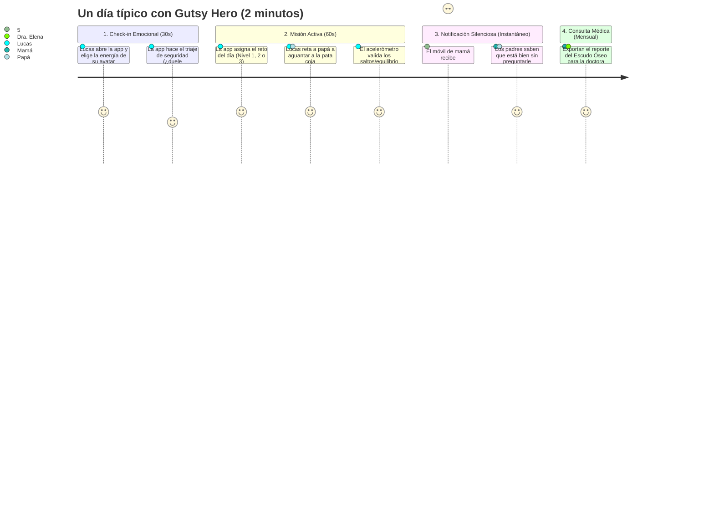

# 📋 Ficha de Producto: Gutsy Hero
### Deporte Adaptado, Comunicación Silenciosa y Salud Ósea en Niños con Crohn

> **Proyecto para HackYeah 2026 — Reto: SPORT & HEALTHCARE**  
> **Equipo:** JoseoKings  
> **Nicho Objetivo:** Niños de 8 años con Enfermedad de Crohn bajo tratamiento con corticoides y sus familias.

---

## 1. El Problema (The Pain Points)

El proyecto resuelve la colisión de **tres problemas críticos** que ocurren al mismo tiempo en el hogar:

| Dimensión | El Problema Real | La Consecuencia |
| :--- | :--- | :--- |
| **Clínica / Médica** | Los corticoides (prednisona/budesonida) necesarios para frenar el Crohn provocan **catabolismo muscular y pérdida severa de densidad ósea** en plena infancia. | Riesgo temprano de osteopenia, fracturas por fragilidad y debilidad física en el patio del colegio. |
| **Familiar / Relacional** | **"La fatiga del interrogatorio"**: Los padres viven con angustia constante y acribillan al niño a preguntas (*"¿te duele?", "¿has ido al baño?", "¿estás cansado?"*). | El niño de 8 años se siente vigilado, diferente a sus amigos, se cierra en banda o miente para no preocupar. |
| **Deportiva / Conductual** | El miedo al brote y el dolor generan **sedentarismo preventivo**. Los padres no saben cuánto ejercicio es seguro y tienen miedo de forzarle. | La falta de estímulo mecánico acelera aún más la atrofia del músculo y el deterioro del hueso. |

---

## 2. Los Usuarios Objetivo (*User Personas*)

### 👦 Usuario Principal: **Lucas (8 años) — El Paciente**
* **Su situación:** Diagnosticado recientemente de Enfermedad de Crohn. Está en una pauta de corticoides de varias semanas; tiene días de dolor abdominal y a veces la cara hinchada por la medicación (*cara de luna llena*).
* **Frustración:** Odia que le recuerden que está enfermo, odia que le pregunten por su tripa y se siente frustrado cuando en Educación Física se cansa antes que los demás.
* **Qué necesita:** Sentirse un niño fuerte y normal, divertirse, y tener una excusa para jugar con sus padres sin hablar de médicos ni medicinas.

---

### 👨‍👩‍👦 Usuario Cuidador: **Marta y Carlos (38 años) — Los Padres**
* **Su situación:** Viven con el corazón en un puño. Cada vez que Lucas pone mala cara, temen que sea el inicio de un brote o una complicación.
* **Frustración:** Saben que Lucas necesita moverse para que los huesos no se le debiliten, pero no saben hasta dónde exigirle sin hacerle daño. Les duele convertirse en los "policías" de su propio hijo.
* **Qué necesitan:** **Tranquilidad sin asfixiar.** Saber en 5 segundos si su hijo hoy tiene energía o necesita descanso, sin tener que someterle a un tercer grado.

---

### 🩺 Usuario Clínico: **Dra. Elena — Gastroenteróloga Pediátrica**
* **Su situación:** Ve a Lucas cada 3 meses en el hospital durante 20 minutos de consulta.
* **Frustración:** Cuando pregunta: *"¿Ha hecho vida activa este mes?"*, los padres responden con recuerdos vagos (*"bueno, algún día caminó..."*). No tiene datos reales de carga física ni de tolerancia.
* **Qué necesita:** Un reporte objetivo de 1 página con la correlación entre días activos, tolerancia al impacto óseo y evolución de energía durante la toma de corticoides.

---

## 3. Propuesta de Valor Única (UVP)

> **"Convertimos la debilidad causada por los corticoides en un juego diario de superhéroes y transformamos el micro-ejercicio en el canal de comunicación silenciosa que devuelve la paz a la familia."**

---

## 4. El Viaje Diario del Usuario (*User Journey* en 2 Minutos)

1. **Paso 1 (Mañana):** Lucas abre la tablet familiar. Elige cómo se siente su monstruo/superhéroe hoy (Batería al 100%, 50% o Modo Reparación).
2. **Paso 2 (Tarde/Juego):** La app le lanza el micro-reto:
   * Si está en Nivel 3: *"¡Desafío Cósmico! Reta a papá o mamá a hacer 10 saltos a la pata coja contigo"*.
   * Lucas se mete el móvil en el bolsillo; el acelerómetro cuenta los 10 saltos. ¡Misión superada!
3. **Paso 3 (Comunicación Silenciosa):** Al móvil de los padres llega una alerta verde:  
   *🟢 "Lucas ha completado su misión de impacto con éxito. Energía alta hoy."*  
   Mamá y papá se relajan: hoy no hace falta preguntarle nada.
4. **Paso 4 (Impacto Clínico):** Cada domingo, la barra del **Escudo Óseo** sube un porcentaje, demostrando que han frenado la desmineralización de los corticoides.

---

## 5. Por qué este perfil encaja como un guante en HackYeah

* **Storytelling potente (Idea & Innovation - 30%):** Lucas, 8 años, Crohn y corticoides. Es un relato humano, emotivo y con una solución técnica impecable.
* **Sport & Healthcare (20%):** El deporte deja de ser un "extra" y pasa a ser la medicina que regenera el hueso y el lenguaje que conecta a la familia.
* **Aplicabilidad Inmediata (20%):** Solo requiere el móvil que ya tienen en casa, 2 minutos al día y cero sensores invasivos.
* **Escalabilidad (*Beachhead*):** Empieza con niños de 8 años con Crohn, y se escala directamente a cualquier niño con enfermedades inflamatorias bajo corticoterapia (artritis idiopática juvenil, síndrome nefrótico, lupus pediátrico).
