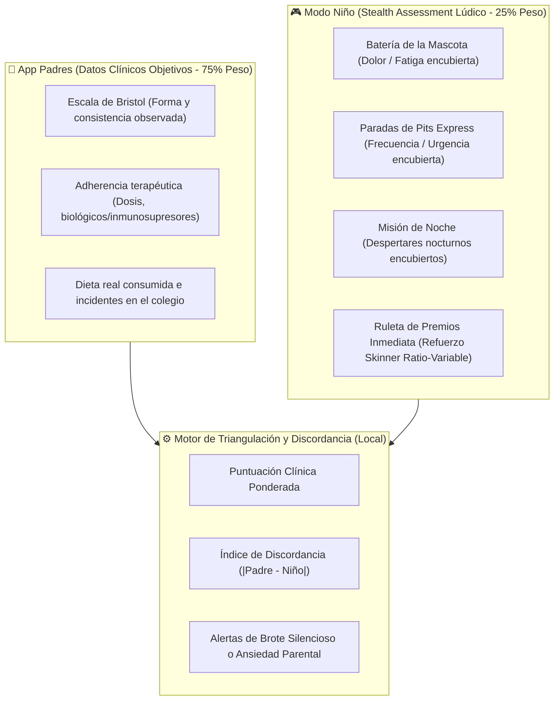
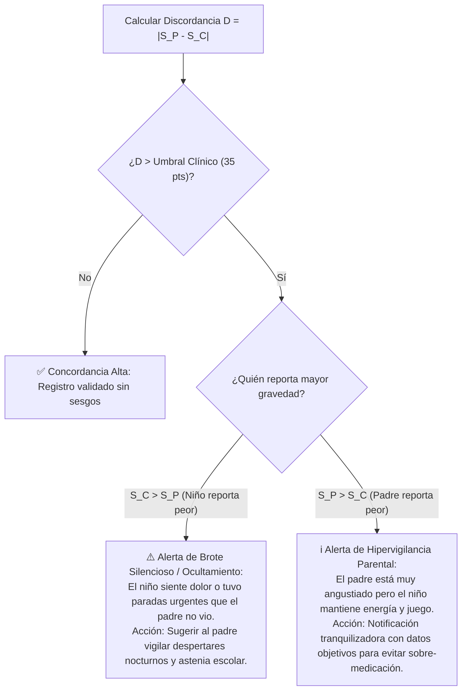

# 🛡️ Stealth Assessment & Pediatric Proxy Triangulation in Crohn's Disease

> **Documento de Investigación Científica y Arquitectura de Datos**  
> **Proyecto:** CrohnCare (JoseoKings - HackYeah 2026, Sport & Healthcare Track)  
> **Tema:** Evaluación pediátrica sutil ("Stealth Assessment"), mitigación de fatiga de encuesta y triangulación matemática Padre-Hijo basada en discordancia clínica observador/paciente.

---

## 1. El Dilema Clínico Pediátrico: Ansiedad Médica vs. Sesgo de Observador

El monitoreo de la enfermedad inflamatoria intestinal pediátrica (EII / Enfermedad de Crohn) enfrenta una paradoja documentada en la literatura gastro-pediátrica:

1. **El estigma de la identidad de enfermo ("Illness Identity") y la fatiga por cuestionarios:**
   Hacer preguntas explícitamente médicas a un niño ("*¿tienes diarrea?*", "*¿sangras al defecar?*", "*¿te duele el intestino?*") induce ansiedad por enfermedad (*illness anxiety*), hiperfocalización somática e incluso conductas de ocultamiento (los niños minimizan síntomas para evitar que los padres se preocupen, los lleven al hospital o les cambien la dieta).
2. **El sesgo de los padres como observadores sustitutos (*Proxy Bias*):**
   Aunque los padres son la fuente más confiable para métricas objetivas (medicación administrada, citas médicas, gasto alimentario), la literatura científica demuestra que **los padres frecuentemente fallan al estimar el estado interno subjetivo del niño**.

### 📚 Evidencia Científica Clave:

* **Vernon-Roberts et al. (2023)** (*Pediatr Gastroenterol Hepatol Nutr*, **PMID: 36950060**):
  * Estudio en díadas padre-hijo con enfermedad de Crohn utilizando herramientas validadas (IBDnow).
  * **Resultado:** En el reporte de síntomas, el **20% de los padres sobrestimó** los síntomas de sus hijos (sesgo de hipervigilancia y ansiedad parental), y el **19% los subestimó** (síntomas nocturnos o dolor visceral que el niño soporta en silencio).
  * **Conclusión:** Solo el 27% de las díadas mostraron acuerdo pleno. Los autores concluyen que *los niños deben ser considerados la fuente principal de sus sensaciones subjetivas*, pero que se requieren herramientas no invasivas para no sesgar el reporte.
* **Loonen et al. (2002)** (*Inflamm Bowel Dis*, **PMID: 12131611**):
  * Los padres son excelentes informadores para componentes **objetivos** de la salud (coeficiente de correlación $r = 0.88$). Sin embargo, para componentes **subjetivos** (dolor visceral, energía, malestar social), la correlación se desploma a $r = 0.62$.
* **Pirinen et al. (2012)** (*Acta Paediatr*, **PMID: 22122226**):
  * Demostró que el acuerdo entre adolescentes con EII y sus padres en síntomas somáticos e internos es muy bajo ($\kappa = 0.00 - 0.38$), con el desacuerdo más agudo en estados de ánimo y fatiga interna ($\kappa = 0.02$).

---

## 2. Paradigma de "Stealth Assessment" (Evaluación Oculta)

Para resolver este problema, la aplicación de CrohnCare divide responsabilidades entre la **App de los Padres** y el **Modo Niño (Mascota Compañera)**:



### Reglas de Diseño Psicológico del Modo Niño:
1. **Terminología Médica Prohibida:** Ni una sola pantalla del niño contiene palabras como *Crohn, diarrea, inflamación, sangre, fármaco, brote, calprotectina o síntoma*.
2. **Metáforas del Avatar/Nave:** El niño interactúa con su compañero (ej. "Capy" el carpincho astronauta o "BellyBot"). Las preguntas no son sobre su enfermedad, sino sobre las aventuras diarias y el rendimiento de su compañero.
3. **Micro-interacción Flash (< 20 segundos):** Solo 2 o 3 preguntas diarias presentadas como el "check-in antes de la ruleta".

---

## 3. Matriz de Transmutación de Preguntas (wPCDAI / PRO2 a Lenguaje Lúdico)

A continuación se detalla cómo se traducen las métricas clínicas estándar validadas (**wPCDAI** - *weighted Pediatric Crohn's Disease Activity Index* y **Pediatric PRO2**) a preguntas cotidianas indetectables para el niño:

| Dominio Clínico | Métrica Médica Original (wPCDAI / PRO2) | Pregunta Médica Habitual (Intrusiva) | Pregunta Lúdica Sutil (App Niño) | Opciones de Respuesta para el Niño | Equivalencia Clínica Interna |
| :--- | :--- | :--- | :--- | :--- | :--- |
| **Dolor Abdominal / Cólico** | wPCDAI: Abdominal pain score (0 = None, 5 = Mild/intermittent, 10 = Severe/activity-limiting) | "¿Te ha dolido la barriga hoy? ¿Tuviste retortijones que te impidieron jugar?" | **"¿Cómo ha estado el motor de tu nave hoy durante el día?"** | 🟢 *"¡A toda máquina, ni se sintió!"*<br>🟡 *"Hizo ruidos raros o cosquilleos, pero seguí jugando"*<br>🔴 *"Se recalentó y tuve que parar a descansar"* | 🟢 Score = 0 (Sin dolor)<br>🟡 Score = 5 (Molestia leve/no incapacitante)<br>🔴 Score = 10 (Dolor moderado/severo) |
| **Frecuencia y Urgencia de Deposición** | PRO2: Daily stool frequency / urgency (0 = Normal, 1 = 1-2 loose stools, 2 = 3+ or urgent) | "¿Cuántas veces fuiste al baño hoy suelto o tuviste que salir corriendo?" | **"¿Cuántas paradas técnicas / de pits tuviste que hacer hoy?"** | 🟢 *"1 o 2 normales, súper tranquilo"*<br>🟡 *"3 o 4, tuve que ir rapidito"*<br>🔴 *"¡Más de 5! Parecía una carrera express"* | 🟢 Normal (0-2 deposiciones)<br>🟡 Moderado (3-4 deposiciones)<br>🔴 Frecuencia alta / tenesmo (5+ deposiciones) |
| **Despertares Nocturnos** | wPCDAI: Nocturnal stooling / awakenings (0 = None, 10 = Awakened by pain/need to stool) | "¿Te despertaste anoche por dolor de tripa o para hacer caca?" | **"¿Cómo fue la misión nocturna de tu personaje anoche?"** | 🟢 *"Dormí de un tirón hasta la alarma"*<br>🟡 *"Me desperté un ratito a tomar agua o moverme"*<br>🔴 *"Tuve que levantarme de golpe al baño a oscuras"* | 🟢 Score = 0 (Sueño continuo)<br>🟡 Score = 2 (Despertar no GI)<br>🔴 Score = 10 (Despertar GI / urgencia nocturna) |
| **Nivel de Fatiga / Bienestar General** | wPCDAI: General well-being (0 = Well, 5 = Below par, 10 = Poor) / PedsQL Fatigue | "¿Cómo te sientes de ánimo y fuerzas en general hoy?" | **"¿Cuánta batería le queda a tu aventurero para la tarde?"** | 🟢 *"100%: ¡Listo para conquistar el mundo!"*<br>🟡 *"50%: Modo peli y sofá tranquilo"*<br>🔴 *"15%: Se me cerraban los ojos y me pesaba el cuerpo"* | 🟢 Score = 0 (Energía normal)<br>🟡 Score = 5 (Astenia leve)<br>🔴 Score = 10 (Fatiga clínica / astenia acusada) |
| **Tolerancia Digestiva / Náusea** | Postprandial comfort / early satiety | "¿Te sentó mal lo que comiste? ¿Tuviste hinchazón o náuseas?" | **"¿Qué tal le cayó el combustible nuevo a tu compañero?"** | 🟢 *"¡Súper poderes! Comí delicioso"*<br>🟡 *"Quedé con la panza algo inflada como un globo"*<br>🔴 *"Uf, no me cayó muy bien, me dio pesadez"* | 🟢 Buena tolerancia<br>🟡 Meteorismo / plenitud precoz<br>🔴 Dispepsia / intolerancia GI |

---

## 4. El Bucle de Micro-Engagement: La Ruleta de Skinner

Para asegurar una tasa de respuesta sostenida sin generar fatiga, el flujo sigue el principio de la **Caja de Skinner con Refuerzo de Razón Variable**:

```
[Apertura de App Niño]
         │
         ▼
[Mascota saludando con animación alegre]
"¡Hola, explorador! Antes de girar la ruleta de hoy, cuéntame 2 cositas rápidas sobre tu día..."
         │
         ▼
[Pregunta 1: Motor de la nave (Dolor)] -> 1 tap
         │
         ▼
[Pregunta 2: Batería restante (Fatiga)] -> 1 tap
         │
         ▼
[¡DESBLOQUEO INMEDIATO DE LA RULETA DE PREMIOS!]
         │
         ▼
[Giro de Ruleta con sonido de fiesta y confeti háptico]
Premios cosméticos aleatorios:
  - 🎨 Color nuevo para el traje del astronauta (Poco común - 30%)
  - 🎩 Sombrero pirata / corona / casco espacial (Raro - 20%)
  - ⭐ Estrellas / Monedas virtuales para desbloquear mundos (Común - 45%)
  - 🌟 Skin Legendaria dorada (Muy raro - 5%)
```

> **Por qué funciona psicológicamente:**
> 1. El niño asocia el check-in con **ganar recompensas cosméticas** para su avatar, no con "reportar a sus padres si está enfermo".
> 2. No hay feedback punitivo: nunca aparece una pantalla roja diciendo "¡Alerta de brote!" en el móvil del niño. La experiencia infantil siempre es positiva y lúdica.

---

## 5. Algoritmo de Triangulación y Detección de Discordancia

Los datos del niño no se toman de forma aislada para emitir diagnósticos; actúan como **validador cruzado** del registro clínico que cargan los padres.

### Modelo Matemático Local:

Definimos la puntuación agregada del **Padre** ($S_P \in [0, 100]$) y la del **Niño** ($S_C \in [0, 100]$):

$$S_P = 0.40 \cdot \text{Bristol}_{norm} + 0.35 \cdot \text{FrecuenciaObs}_{norm} + 0.25 \cdot \text{AdherenciaMed}_{norm}$$

$$S_C = 0.40 \cdot \text{MotorNave}_{norm} + 0.30 \cdot \text{Batería}_{norm} + 0.30 \cdot \text{MisiónNoche}_{norm}$$

El **Índice Compuesto de Actividad (ICA)** se calcula ponderando $75\%$ datos del padre y $25\%$ datos subjetivos del niño:

$$\text{ICA} = 0.75 \cdot S_P + 0.25 \cdot S_C$$

### Detección de Discordancia ($D = |S_P - S_C|$):



### Casos Prácticos de Triangulación Clínica:

1. **Caso 1: Brote Oculto en el Colegio (Silent School Flare)**
   * *Padre:* Reporta Bristol 4 (normal) por la mañana y cree que el día fue perfecto ($S_P = 15$).
   * *Niño:* Responde que hizo "¡Más de 5 paradas técnicas express!" y que su batería estaba en "15%" ($S_C = 80$).
   * *Resultado del Algoritmo:* **Discordancia Crítica tipo $S_C > S_P$**.
   * *Acción en App Padres:* *"Aviso de bienestar: Tu hijo reportó haber necesitado varias pausas rápidas y fatiga baja hoy durante el día. Pregúntale con cariño cómo le fue en el cole sin agobiarle."*
2. **Caso 2: Hipervigilancia por Alimento Nuevo (Parent Anxiety Buffering)**
   * *Padre:* Le dio un alimento nuevo y reporta extrema preocupación ($S_P = 70$), temiendo un rebrote.
   * *Niño:* Responde motor al 100%, súper poderes y durmió de un tirón ($S_C = 10$).
   * *Resultado del Algoritmo:* **Discordancia tipo $S_P > S_C$**.
   * *Acción en App Padres:* *"Tranquilidad: Aunque estés atento a la nueva comida, el nivel de energía y descanso de tu hijo se mantiene en rangos óptimos hoy."*

---

## 6. Privacidad y Cumplimiento Normativo (RGPD Art. 8 & 9)

En cumplimiento con el consenso de arquitectura alcanzado para el Hackathon:
* **Zero Servidores / Local First:** Toda la triangulación matemática se ejecuta en el teléfono local de los padres.
* **Dispositivo del Niño Inmune a Datos de Salud:** La base de datos del móvil infantil solo almacena pares clave-valor inofensivos (`avatar_skin: "gold_helmet"`, `energy_level: 2`, `pit_stops: 1`). Si un compañero de colegio o un extraño mira el teléfono del niño, solo ve un juego con un carpincho o robot espacial.
* **Sincronización Silenciosa:** Los 3 datos del check-in se transfieren al teléfono del padre vía Bluetooth Low Energy (BLE) local o código QR efímero en la cena familiar.

---

## 7. Conclusión para el Jurado del Hackathon

Este enfoque demuestra:
1. **Rigor Científico de Vanguardia:** Basado en estudios recientes de discordancia padre-hijo (Vernon-Roberts 2023, Loonen 2002, Pirinen 2012).
2. **Empatía Pediátrica Real:** Elimina el estigma y la "depresión de paciente crónico" mediante *Stealth Assessment*.
3. **Innovación Algorítmica:** No es una app de encuestas aburridas; es un motor de triangulación que corrige el sesgo del observador mientras divierte al niño con una ruleta de refuerzo positivo.
